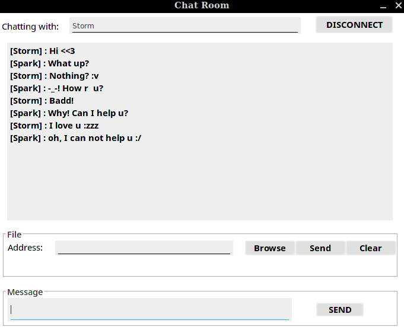
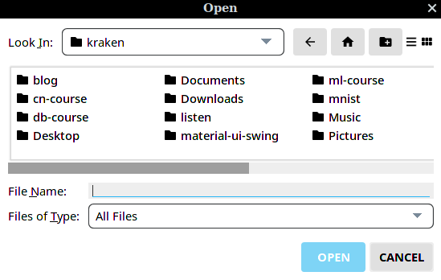
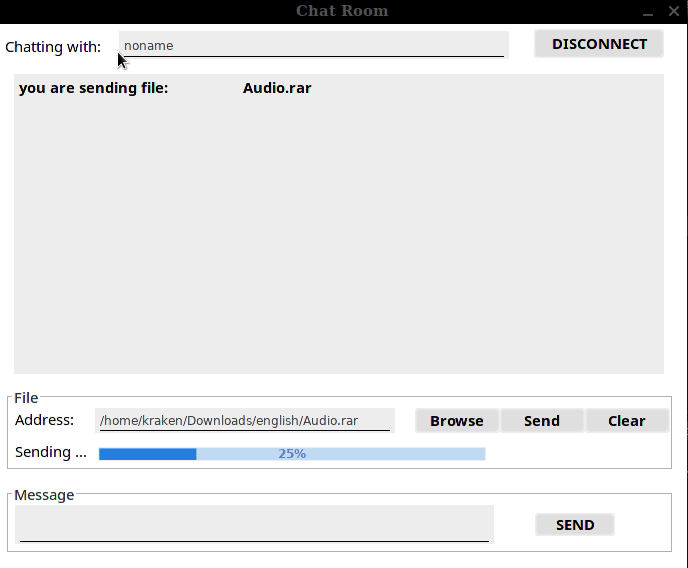
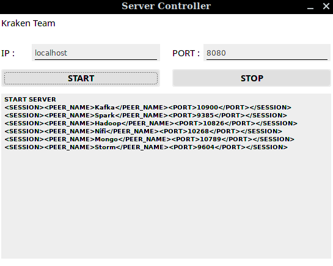
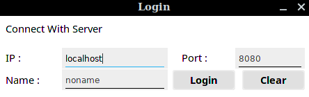
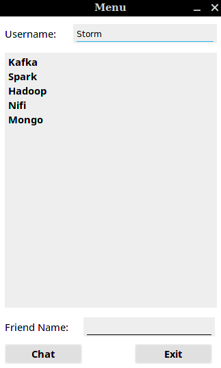

# How to compile socket-chat project

- First, you need to install some packages.
   1. Open JDK 1.8 (or newer version)
   2. Maven 3.6.0 (or newer version)
- Second, type two following command to compile this project.
```
mvn compile assembly:single -f server.xml
mvn compile assembly:single -f client.xml
```
- Finally, type two following command to run.
```
java -jar target/socket-chat-server-release-1.0.0-jar-with-dependencies.jar
java -jar target/socket-chat-client-release-1.0.0-jar-with-dependencies.jar
```

*Note* : You can build a container to compile. We prepared a docker file in this repository.

# Demonstration

1. Client chat window

<p align="center">
  
</p>

2. Browse file window

<p align="center">
  
</p>

3. Send file demo

<p align="center">
  
</p>

4. Server controller window

<p align="center">
  
</p>

5. Client login window

<p align="center">
  
</p>

6. Client menu window

<p align="center">
  
</p>

